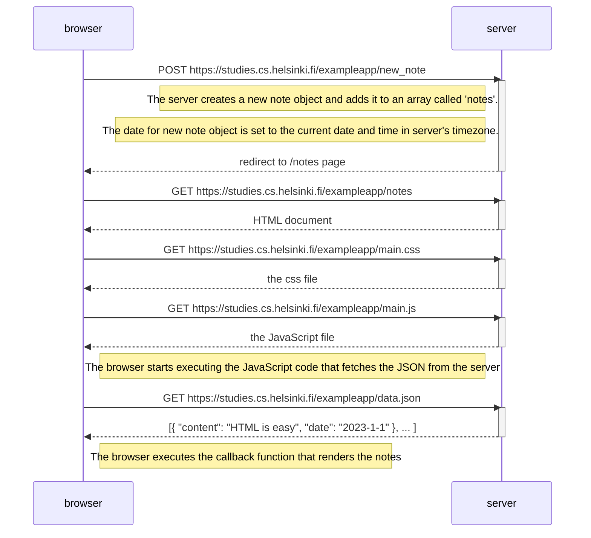
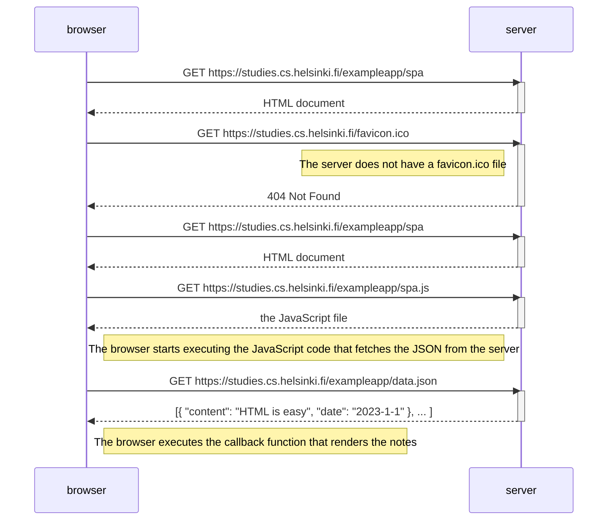
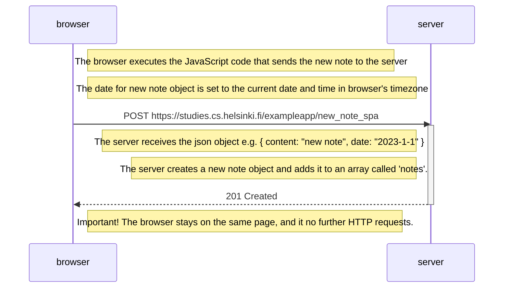

## 0.1: HTML

_This exercise is not submitted to GitHub, it's enough to just read the tutorial_

## 0.2: CSS

_This exercise is not submitted to GitHub, it's enough to just read the tutorial_

## 0.3: HTML forms

_This exercise is not submitted to GitHub, it's enough to just read the tutorial_

## 0.4: New note diagram

Here is a diagram depicting the situation where the user creates a new note on the page https://studies.cs.helsinki.fi/exampleapp/notes by writing something into the text field and clicking the `Save` button.

## 0.5: Single page app

Here a diagram depicting the situation where the user goes to the _single-page_ app version of the notes app at https://studies.cs.helsinki.fi/exampleapp/spa.

## 0.6: New note in Single page app diagram

Here is a diagram depicting the situation where the user creates a new note on the _single-page_ app version of the notes app at https://studies.cs.helsinki.fi/exampleapp/spa by writing something into the text field and clicking the `Save` button.

